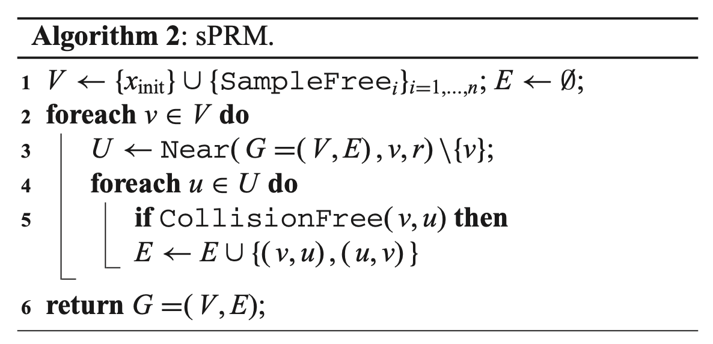
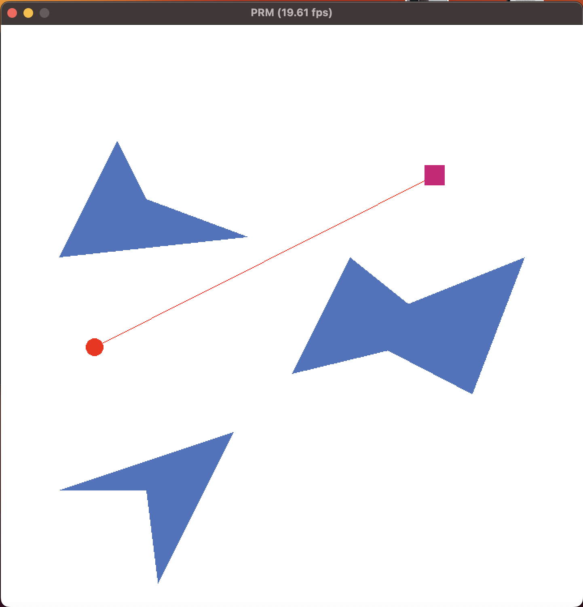
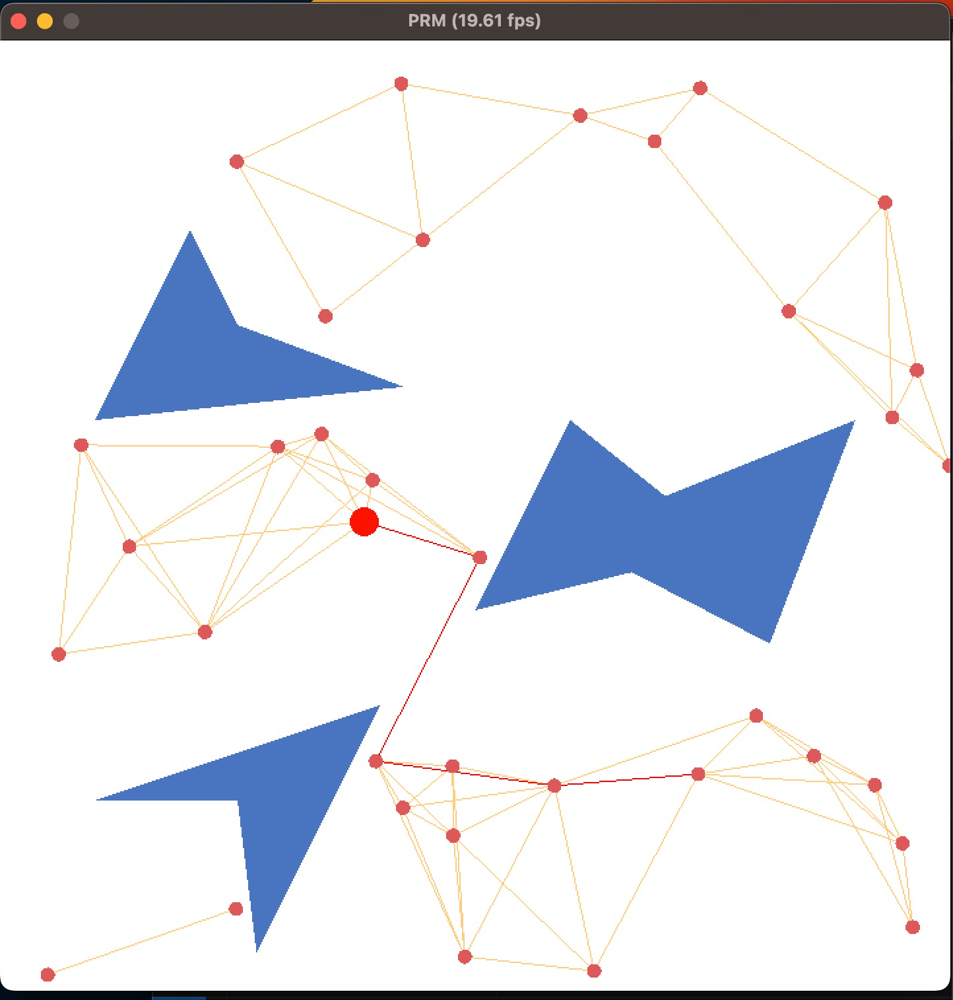
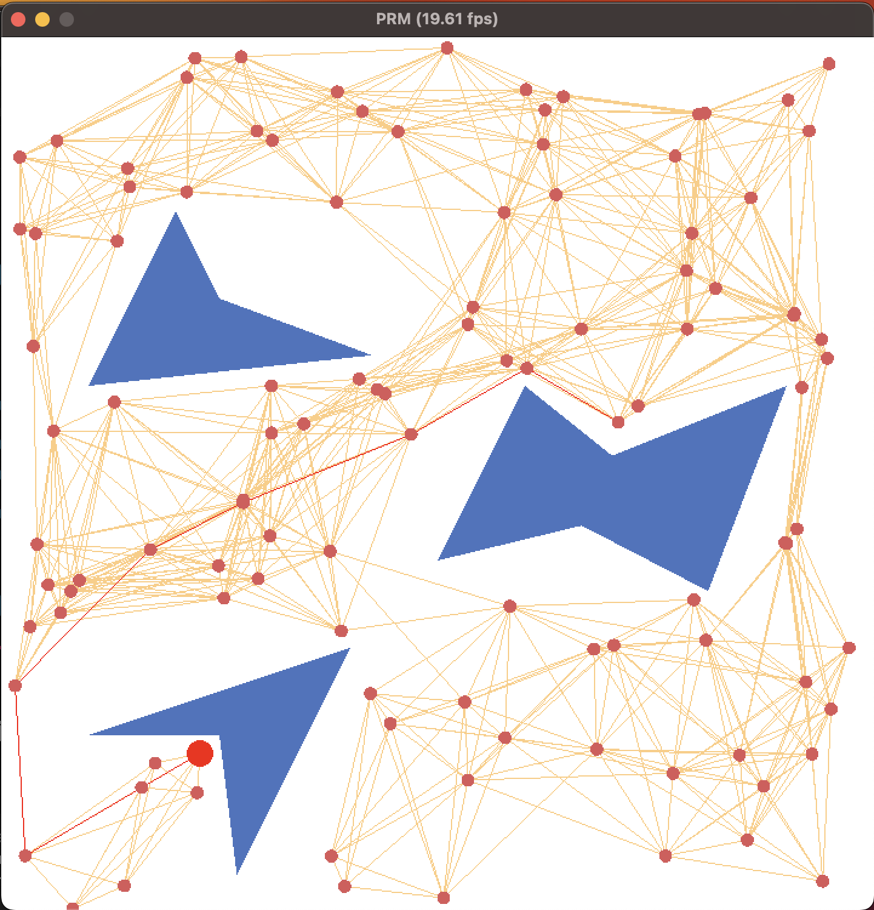
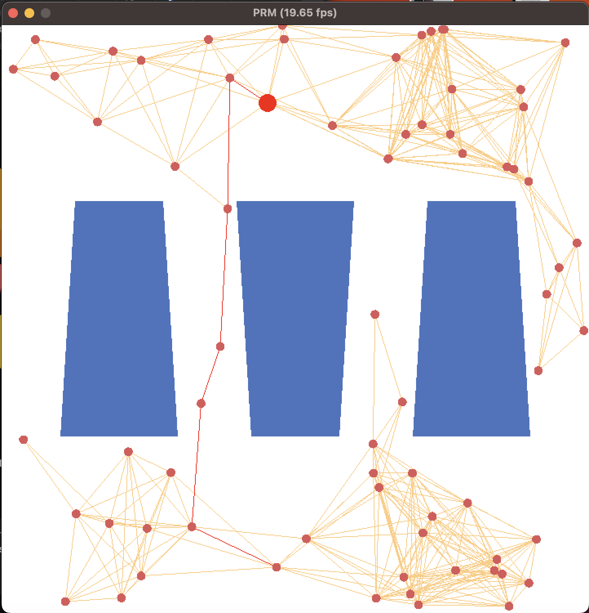

# Tarea 3. Probabilistic Random Map

Emmanuel Alejandro Larralde Ortiz

### Instalación

### Sobre el simulador

EL simulador fue programado utilzando `PyGame` con `PyOpenGL`. `PyGame` proporciona la interfaz gráfica y el manejo de eventos como "presionar una tecla" o "hacer clic con el mouse", mientras `PyOpenGL` es utilizado para dibujar sobre la interfaz gráfica.

### Sobre el algoritmo implementado

Se utiliza el `PRM` con algunos pasos extras. El PRM se utiliza para tareas de planificación *single-query*. Entonces termina cuando se encuentra un camino libre y cada vez que se actualizan el *inicio* o la *meta*, se descarta el grafo que había sido generado previamente (esto es incorrecto pero bastante ilustrativo). Además, antes de comenzar a construir el grafo, se revisa si existe visibilidad entre el inicio y la meta. En ese caso, no hay necesidad de construirlo.

#### Algoritmo base

#### Modificaciones del algoritmo

En lugar de generar una muestra de $n$ `milestones`, se construye el grafo de forma iterativa. En cada iteración:

1. Se genera un número pequeño $k$ de muestras en el espacio de configuraciones.
2. Las muestras en el espacio libre se convierten en *milestones*. Las demás se descartan.
3. Para cada *milestone* nuevo, se seleccionan hasta $m$ *milestones* que se encuentren a una distancia menor a $\theta$. Con estas limitaciones reducimos la cantidad de conecciones posibles y es más fácil visualizarlas.
4. Para cada *milestone* nuevo y cada *milestone* de su vecindad (paso 3), se conectan aquellos pares que tengan un camino recto libre de colisiones.
5. Cada cierta cantidad $t$ de iteraciones, se trata de generar un camino.

Si existe un camino o se separó una cantidad de iteraciones máximas, se detiene el algoritmo.

### Resultados

#### Camino libre existente

#### Inicio y meta colocados al azar

#### Camino y meta colocados cerca de los obstáculos.

#### Escenario topológico

### Bugs conocidos

- Líneas rectas verticales:
Cuando una línea es vertical, el cálculo de su pendiente es muy grande, produciendo resultados numéricos poco precisos. No es posible determinar con seguridad la distancia de un punto hacia esta recta.